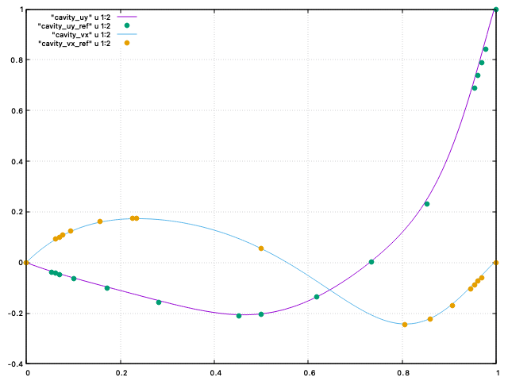
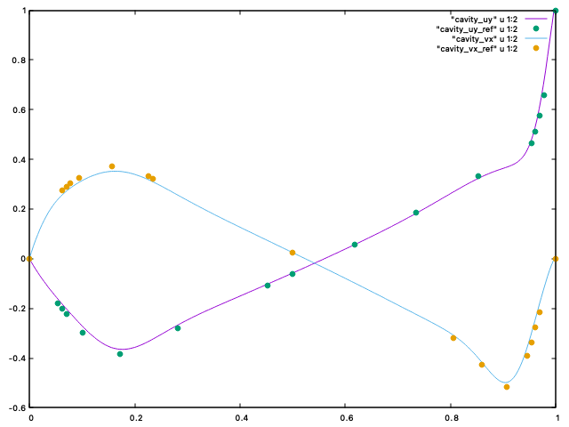

# lbm

A simple lattice-Boltzmann code for 2D flow resolutions.

  

## Contents

This LBM code includes:

- D2Q9 lattice
- TRT collision operator
- Zou-He on all boundary conditions
- Drag/lift computation using interpolated bounce-back
- Core routines are deferred to Numba

## Running simulations

Cases are described in the `lbm/src/app/` repository. To run a simulation, adjust the parameters in the related python file, then run `python3 start.py <app_name>`. A results folder will be generated in `./results/` with the current date and time. If you wish to add a new application, you must create a new app, and register it in the factory, located in `lbm/src/app/app.py`. Below are some examples and benchmarks that were ran with the code. The related cases are available in the repository. The computational times are obtained on a standard laptop.

## Benchmarks

### Lid-driven cavity

A simple driven cavity in unit square. Below are the computed time-domain velocity norms at `Re=100` (left) and `Re=1000` (right).

   

A comparison of `u = f(y)` and `v = f(x)` at the center of the domain with reference data from <a href="https://www.sciencedirect.com/science/article/pii/0021999182900584">"U. Ghia, K. N. Ghia, C. T. Shin, *High-Re solutions for incompressible flow using Navier-Stokes equations and multigrid method*"</a>.

   

### Turek benchmark

The Turek cylinder benchmark CFD case is described in <a href="https://link.springer.com/chapter/10.1007/978-3-322-89849-4_39">"Schafer, M., Turek, S. *Benchmark Computations of Laminar Flow Around a Cylinder*"</a>. Here, we explore the accuracy of the drag and lift computation (using IBB). Note that for the 2D-2 case, the values correspond to the max drag and lift.

|        |`ny` | 2D-1 (Re=20) Cd, Cl, CPU   | 2D-2 (Re=100) Cd, Cl, CPU  |
|--------|-----|----------------------------|----------------------------|
| Turek  | --- |  5.5800 - 0.0107 - N/A     |  3.2300 - 1.0000 - N/A     |
| lbm    | 100 |  5.7111 - 0.0285 - 236 s.  |  3.5409 - 1.0696 - 518 s.  |
| lbm    | 200 |  5.6250 - 0.0212 - 1367 s. |  3.2959 - 1.0253 - 2762 s. |

Below is a video of the 2D-2 case:

  

## Applications

### Array of obstacles

An array of square obstacles at `Re=2000`, with `ny=200`. This computation took approx 20 minutes on my laptop, although the accuracy here is questionable.

  

### Double step in channel

Two steps in a channel at `Re=500`, with `ny=150`. This computation took approx 15 minutes on my laptop.

  

